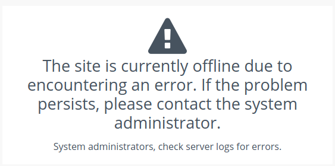
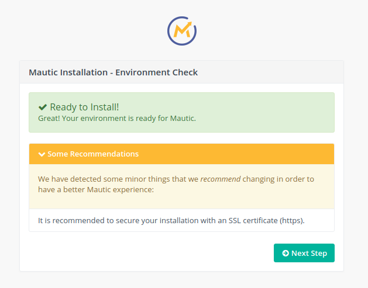
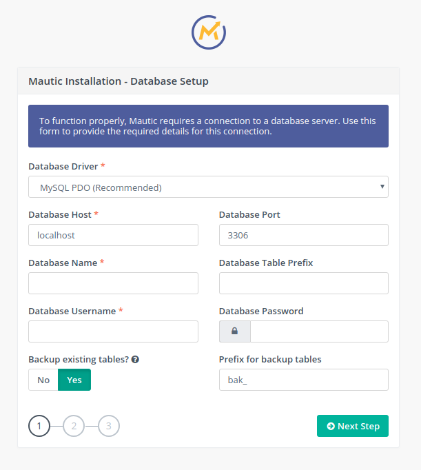
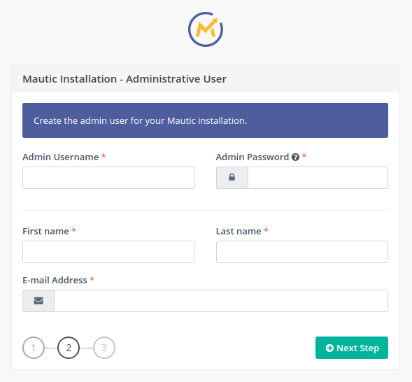
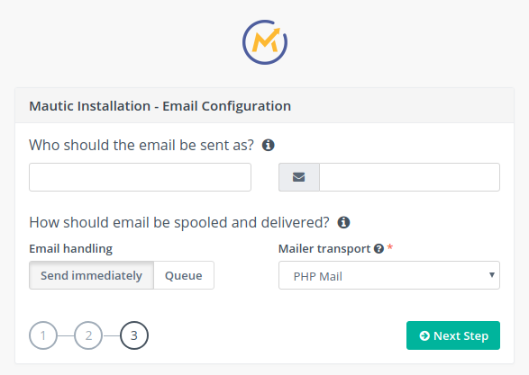
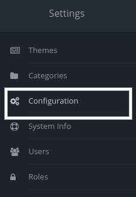
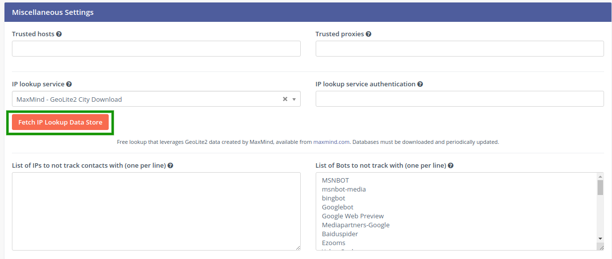

---------------------

Awesome! You've downloaded a marketing automation tool. That's a great first step, but now you wonder where to go from here. Follow this very simple guide to get started using your shiny new toy!

## Step 1: Install Mautic

If you have already downloaded the zip from the [download page][download-page] or have installed Mautic through some other source (Softaculous, Bitnami, Digital Ocean etc...) then you have already completed the first step. If not then you will need to upload the Mautic package (a zip file) to your server; unzip the files; and then navigate to that location in your browser.

As an example, if your domain is `example.com` and you have unzipped the file into a folder called `mautic`, you would then browse to `https://example.com/mautic` to start the installation process.

### Permission errors

If you see errors when you try to access the installation as below:



the problem is likely to be due to the permissions on your files and folders.

If you have access to the command line, you can run the following commands to reset the file and folder permissions.  Ensure you are in the directory where Mautic has been installed.

#### Finding your website root directory

Depending on your server configuration, the default path to a _website_ is usually something similar to `/var/www/website` or `/var/www/website/public_html`. For [Apache][apache] this is the [DocumentRoot][document-root] path and for [Nginx][nginx] it is the [`root`][root] path.

> NB: the _website_ is also known as _site_, _vhost_, _virtualhost_ or _server block_.

Continuing the example above, that would mean executing these commands within the `/var/www/example.com/mautic` directory.

#### File ownership

The owner of the files is probably going to be `www-data` in a VPS/EC2/Droplet environment, and your user ID in a shared hosting environment.

In a shared environment, start with this:

```console
cd /var/www/example.com/mautic
chown -R $USER:www-data .
```

and continue with the `find` and `chmod` commands below.

In a VPS/EC2/Droplet, you will need to prefix `sudo` to change the permissions and ownership.

```console
cd /var/www/example.com/mautic
sudo chown -R www-data:www-data .
```

and continue with the `sudo` prefix for the commands below:

* `sudo find ...`
* `sudo chmod ...`

```console
find . -type d -not -perm 755 -exec chmod 755 {} +
find . -type f -not -perm 644 -exec chmod 644 {} +
chmod -R g+w app/cache/ app/logs/ app/config/
chmod -R g+w media/files/ media/images/ translations/
```

### Pre-flight checks

Once the permissions are correct, you should see the 'pre-flight checks' which ensures that your server is running software compatible with Mautic.

Critical issues will be displayed in red and will not allow you to proceed until you resolve them, as Mautic cannot run unless you fix these problems.

Advisory issues will be displayed in orange.  These issues are 'should fix', however you will be able to proceed with the installation without resolving them.



In the example below, you can see that we are being _advised_ that we should secure our Mautic instance with an SSL certificate.  You might see other warnings relating to PHP extensions that are necessary to provide certain non-essential features such as IMAP email inbox checking and internationalisation - you should determine whether these are important to you, and fix them as appropriate.

Refreshing this screen after fixing the issues (and, where appropriate, restarting your PHP server) will update the list and advise you of any remaining issues to be addressed before installing Mautic.

### Database setup

In the next step you will be asked to provide the details for a database that Mautic will use.  The database needs to be MySQL with InnoDB support, at a minimum version of 5.5.3.



The host will often be localhost and the port 3306, but check this with your hosting provider if you experience problems.  Ideally you will have already created the database for Mautic to use, but if you haven't, ensure that the user has permission to create new databases.

Enter the database name, prefix (eg. mau_) which will be prepended to all tables that are created, and provide the username and password for a user with access to the database.

The options for backing up existing tables only apply if you are installing multiple Mautic instances in the same database - in which case you may want to back up any tables that already exist using the same prefix, using the backup table prefix bak_.  This will rename any existing tables it finds using the same prefix of mau_ so that they will become bak_mau_. It is safe to leave this enabled, just in case there are tables already existing!

This step may take a few minutes to complete, as the database is created and populated.

### Admin user

The next step after creating the database is to set up your administrator account.  This will be the account you use to log into Mautic for the first time.



Enter a username, password, first and last name and an email address, and the account will be created for you.

### Email configuration

The next step allows you to configure the way in which email is sent from your Mautic instance.



If you are testing, whether locally or on a live server, it is highly recommended to make use of [Mailhog][mailhog] or similar to capture all outgoing emails, until you are ready to send to real recipients. Otherwise, in a production environment you will need to choose whether you want to send email immediately, or queue email (and process it when the Cron job runs), and provide the appropriate server, port, encryption type, credentials and authentication mode for the systems you wish to use.

### Admin login

Now you have completed the setup process, you will be directed to the back-end login screen at `http(s)://example.com/mautic/s/login` - this is where you log into your Mautic to manage your instance, so it's worth bookmarking the login page for future reference.

## Step 2: Add Cron Jobs

Once you've installed Mautic you will need to create a few standard [cron jobs][cron-jobs] to have your software process various tasks. These [cron jobs][cron-jobs] can be created through a cPanel or added through command line. Here is a list of the [cron jobs][cron-jobs] you'll need to create. (Please note: "/path/to/mautic..." will reflect the directory where your version of Mautic is installed, and you may need to replace 'php' with the path to PHP on your server. Ask your hosting provider if you are not sure.)

### Updating Segments

`php /path/to/mautic/bin/console mautic:segments:update`

### Update Campaigns

`php /path/to/mautic/bin/console mautic:campaigns:update`

### Execute Campaign Actions

`php /path/to/mautic/bin/console mautic:campaigns:trigger`

Review the page on [cron jobs][cron-jobs] for more information on these and other optional cron jobs.

## Step 3: Download the IP lookup service database

By default, Mautic is configured to use MaxMind's free GeoLite2 IP lookup database. Due to the licensing of the database, it cannot be included with Mautic's installation package and thus must be downloaded. Click on the cogwheel in the upper right hand of Mautic to view the Admin menu then click Configuration. This is where most of the configuration takes place.



On the System Settings tab, scroll down to find the IP lookup service option and click the "Fetch IP Lookup Data Store."



You could also choose another supported IP lookup service if you prefer.

## Step 4: Install the Tracking Javascript

After installation and setup of the cron jobs you're ready to begin tracking contacts. You will need to add a simple javascript to the websites for each site you wish to track via Mautic. This is a very simple process and you can add this tracking script to your website template file, or install a Mautic integration for the more common CMS platforms. Here is an example of the tracking javascript which you can access by clicking on 'Tracking Settings':

    <script>
    (function(w,d,t,u,n,a,m){w['MauticTrackingObject']=n;
        w[n]=w[n]||function(){(w[n].q=w[n].q||[]).push(arguments)},a=d.createElement(t),
        m=d.getElementsByTagName(t)[0];a.async=1;a.src=u;m.parentNode.insertBefore(a,m)
    })(window,document,'script','https://example.com/mautic/mtc.js','mt');

    mt('send', 'pageview');
    </script>

You will need to change the site URL (replace example.com/mautic with the URL to your Mautic instance) in the above script.

Checkout [Contact Monitoring][contact-monitoring] for more details.


[download-page]: <https://www.mautic.org/download>
[apache]: <https://httpd.apache.org/docs/current/>
[document-root]: <https://httpd.apache.org/docs/current/mod/core.html#documentroot>
[nginx]: <https://nginx.org/en/docs/>
[root]: <https://nginx.org/en/docs/http/ngx_http_core_module.html#root>
[mailhog]: <https://github.com/mailhog/MailHog>
[cron-jobs]: </setup/cron-jobs>
[contact-monitoring]: </contacts/manage-contacts/contact-monitoring> 