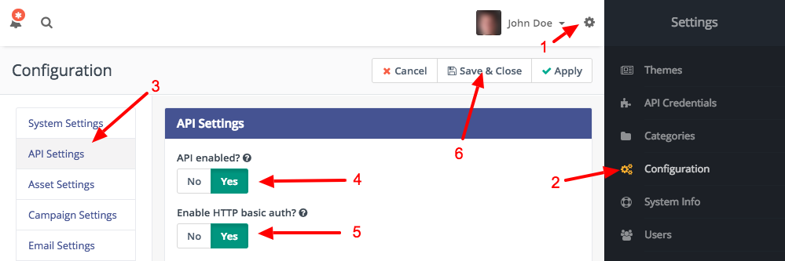
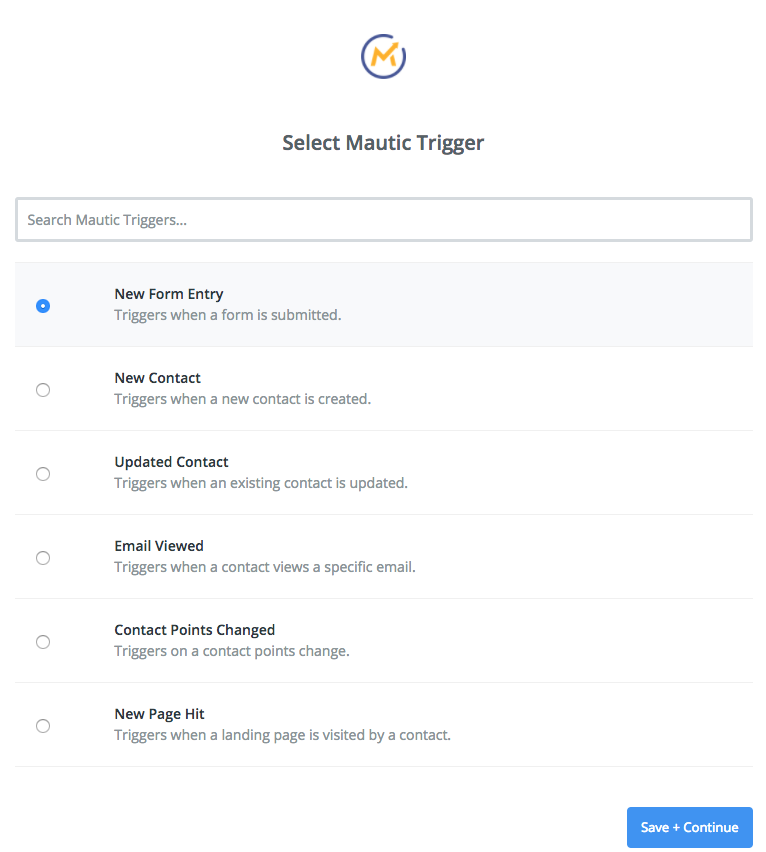
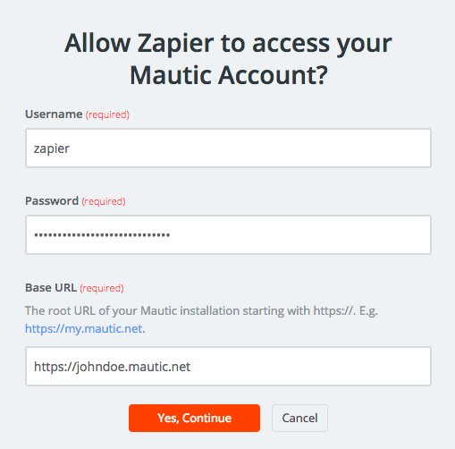
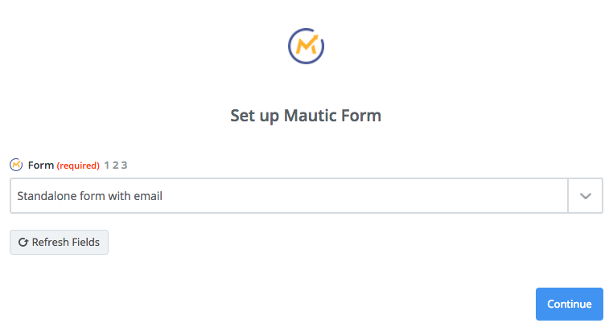
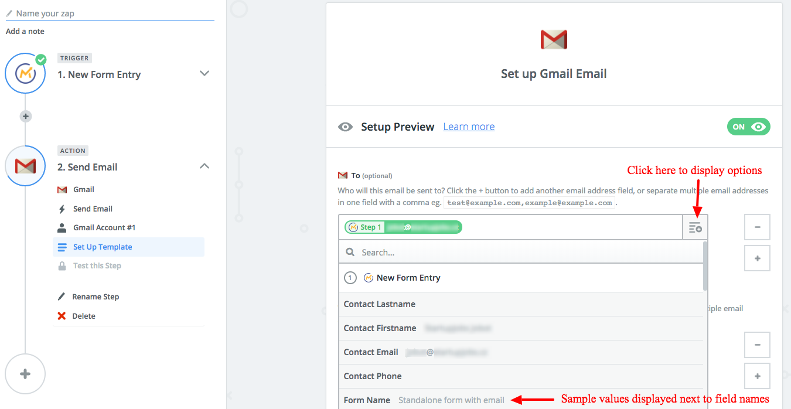

---
title: 'Zapier'
media_order: ''
body_classes: ''
order_by: ''
order_manual: ''
----------------------

## Mautic Zapier Integration

This integration integrates any Mautic instance with 1.100+ third party web services via the [Zapier](https://zapier.com) web automation service.

## Requirements

1. Mautic version 2.9.0 or newer with SSL - basic authentication requires HTTPS to be secure.
3. Zapier account. Free or Paid. [View Zapier pricing](https://zapier.com/pricing/).

## Installation

There is no need to install any additional plugin to your Mautic instance. Zapier works with the API and webhooks already available within Mautic. This Zapier integration use Basic Authentication to access Mautic API. It is disabled by default so enable this first.

1. Open the admin menu
2. Go to Mautic's global configuration
3. Go to API Settings
4. Set __API enabled?__ to __Yes__.
5. Set __Enable HTTP basic auth?__ to __Yes__.
6. Save the configuration.

Zapier will be able to create actions and triggers with your Mautic installation.

## Sign up for a Zapier account

1. Go to the [Zapier website](https://zapier.com).
2. Select the "Sign Up for Free" button.

Or log into your existing Zapier account.

## Setup and configuration

The configured Zapier integrations are called Zaps. The main types of Zaps are Triggers and Actions.

- Triggers send data about some actions that happen in Mautic in realtime to Zapier. Zapier then transforms the data and sends it to the next app you have configured in the Zap.
- Actions send data from some other app into Mautic.

### Supported Triggers
- [x] **New Contact** - _contains contact info and field values_
- [x] **Updated Contact** - _contains contact info and field values_
- [x] **Contact Points Changed** - _contains contact info, point value and field values_
- [x] **Email Viewed** - _contains contact info and field values and info about the email_
- [x] **New Page Hit** - _contains contact info and field values, info about the page hit and the page itself_
- [x] **New Form Entry** - _contains contact info and field values, info about the form and about the submission including submitted values_

### Supported Actions
- [x] **Create or Update Contact**

### 1. Find Mautic integration

When you click on _Make a Zap!_ button, search for Mautic. You may see some unofficial Mautic integrations there. We recommend to use this one. It will always be called "Mautic (2.1.0)". Of course the version number will change in time. The latest version number is available within each changelog at https://github.com/mautic/mautic-zapier/releases.

If you want some inspiration or speed up the process of creating a Zap use preconfigured Mautic Zap templates:

### 2. Choose a Trigger or Action

At this point choose which Trigger or Action you need. Each trigger will get you some data about the Mautic event (page hit, email viewed, form submitted) and about the contact who did the event.

### 3. Authorize Mautic instance

Once you choose to use Mautic integration you'll need to authorize your Mautic to it. Mautic use basic auth as mentioned earlier. So all you need is a Mautic user credentials and URL of where your Mautic lives. It's recommended to create a new user for Zapier which will have some advantages:

1. Giving a third party app credentials to your Mautic is a security risk. If something happens you simply delete this special Zapier user and your admin user will be safe.
2. You will see what contacts were created by Zapier simply by looking at the created by user.

### 4. Select an item for Triggers

Triggers will ask you to choose which entity you want to record events about. This step is required for Form Submission trigger because every form has different form fields, but it's optional for others. If you skip this step for for example Page Hits trigger Zapier will process all page hit events.

Zapier will let you test the integration you just configured.

### 5. Map fields

Now map the Mautic fields to the fields of the other app. In the image below is an example of mapping Mautic fields from Mautic's New Form Entry Trigger to GMail's Send Email Action.

That's it! Now if a contact submits a Mautic form the contact gets an email. Okay, so Mautic can do that on its own, but you get the general idea.

## How does this work

This happens when you create a new action or trigger at Zapier.

1. Zapier creates a new webhook via Mautic API at your Mautic instance specifically for this one Zap. Mautic will then send all events related to the trigger or action type to Zapier.
2. Zapier lets you map Mautic fields to the fields of the integration you want to connect to Mautic.
3. Once you make your Zap active Mautic will start receiving data (in the case of actions) and sending data (in the case of triggers).

## Integration development

Even this integration is developed as an open source software as is usual with Mautic community. Learn more at https://github.com/mautic/mautic-zapier.
